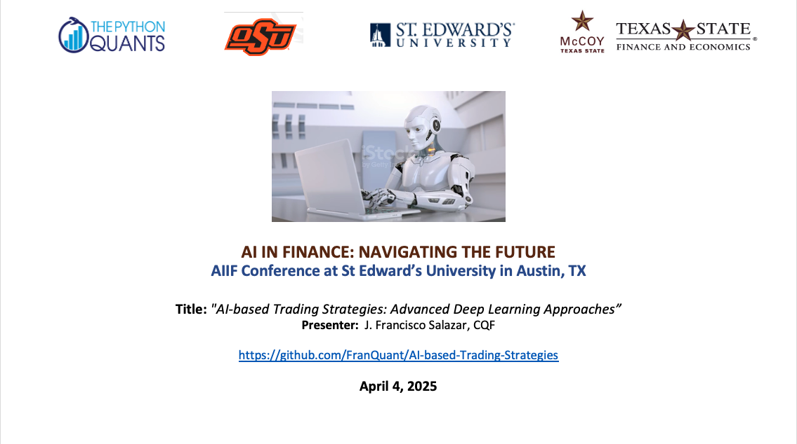
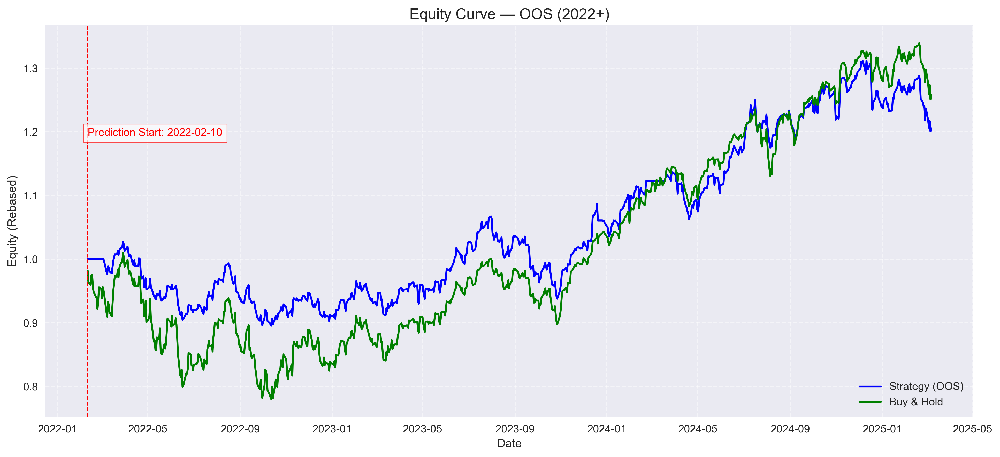
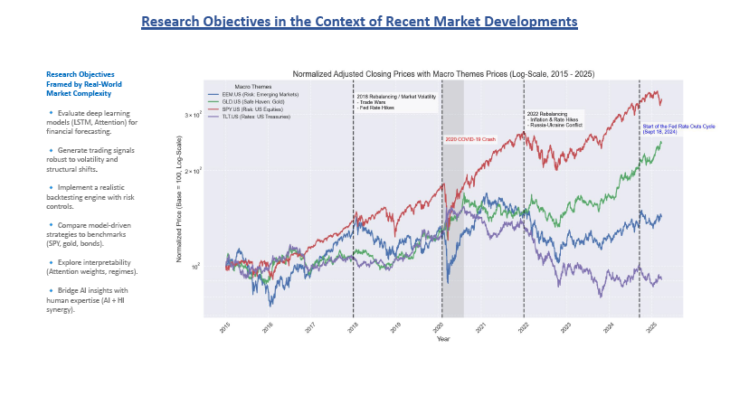

# AI-based Trading Strategies: Comparing Deep Learning Architectures


This repository presents a structured framework for developing and evaluating AI-driven trading strategies, with a focus on **systematic risk premia**. The project integrates cutting-edge deep learning architectures with robust backtesting and interpretability tools — all within a modular and extensible research pipeline.

## Description:
This project deploys a systematic, AI-driven framework to develop and evaluate quantitative trading strategies. Our modular pipeline integrates data acquisition with advanced feature engineering —to produce high-quality inputs for our models. We implement a suite of deep learning architectures, including a GRU, a standalone LSTM model, and an LSTM-CNN hybrid, all validated through rolling cross-validation and realistic backtesting that incorporates transaction cost adjustments. Performance is benchmarked against a buy-and-hold baseline, and the framework supports rapid experimentation with alternative architectures such as LSTM with attention mechanisms and transformers. 


## Neural Networks for Trading Strategies
Neural networks (NNs) have been widely adopted in trading strategies due to their ability to model nonlinear relationships, detect patterns, and adapt to changing market conditions. The evolution of deep learning architectures, including convolutional neural networks (CNNs), recurrent neural networks (RNNs), and transformer-based models, has further enhanced their predictive power. NNs have revolutionized trading by enhancing prediction accuracy, optimizing execution, and identifying alpha signals in ways that traditional methods cannot. However, challenges such as interpretability, overfitting, and computational cost must be addressed for robust deployment.

Long Short-Term Memory (LSTM) networks are a specialized type of RNNs designed to handle sequential data and long-term dependencies—making them particularly well-suited for financial time-series forecasting and trading strategies. LSTMs are a powerful tool for time-series forecasting and trading, but they require careful tuning and robust validation. With recent advancements in deep learning, transformer architectures have proven highly effective in time-series forecasting, outperforming LSTMs and traditional statistical models.

### Transformer vs SPY Benchmark



Deep learning models enable systematic strategies to:
- Capture **non-linear relationships**
- Detect **regime shifts** and **volatility clusters**
- Generate adaptive **position sizing signals**

This project uses:
- **LSTM** for sequential modeling  
- **GRU** as a compact alternative  
- **CNN-LSTM** for local-global patterns  
- **Attention-LSTM** for interpretable dynamics  
- **Transformers** for end-to-end forecasting


#### LSTM with Attention-Based Trading Strategy
Our approach leverages a state-of-the-art deep learning architecture that combines the sequential modeling strengths of LSTM networks with an attention mechanism designed to isolate and weigh the most predictive segments of historical market data. This attention-based framework also opens promising avenues for systematic exploration in asset allocation strategies, enabling dynamic weighting of assets informed by adaptive market regime detection.


### Attention-LSTM vs SPY Benchmark
#### Attention-LSTM OOS Results


## Project Structure
```
AI-based-Trading-Strategies/
├── data/
│   └── GSPC_fixed.csv
│
├── envs/
│   └── env_models_tf2.yml
│
├── notebooks/
│   ├── 1_stacked_lstm.ipynb
│   ├── 2_gru.ipynb
│   ├── 3_cnn_lstm.ipynb
│   ├── 4_attention_lstm.ipynb
│   └── 5_transformer.ipynb
│
├── outputs/
│   ├── 04_ATT_LSTM_clean/
│   │   └── oos_final/
│   │       └── equity_curve_oos_enhanced.png
│   └── 05_TRANSFORMER/
│       └── oos_final/
│           └── equity_curve_oos_enhanced.png
│
├── presentation_assets/
│   ├── 1st_slide.png
│   ├── AIFC 2025.pdf
│   └── Mkts_Dev.png
│
├── .gitignore
├── README.md
└── requirements.txt

```

## Motivation
This research aims to bridge AI interpretability and portfolio realism, contributing to the next generation of systematic strategies:

- Enhanced forecasting in noisy environments
- Smarter, cost-aware execution
- Modular testing of AI-based allocation models



## Methodology
## 📌 Methodology Overview

1. **Data Collection & Preprocessing**  
   - Normalization and cleaning  
   - Binary labeling based on rolling returns and volatility; regime detection features were tested but removed in final pipeline

2. **Model Development**  
   - Model training (LSTM, GRU, CNN-LSTM, etc.)  
   - Cross-validation and performance tracking

3. **Strategy Construction**  
   - Convert predictions to trading signals  
   - Apply overlays (stop-loss, volatility sizing, hybrid constraints)

4. **Backtesting & Evaluation**  
   - Use QuantStats, and Sharpe sensitivity  
   - Visualize performance: cumulative return, drawdown, signal frequency

     
## Installation & Requirements

The project is built using Python 3.8+ and relies on several key libraries. To set up the environment, clone the repo and install dependencies:

Clone the repository:
```
git clone https://github.com/FranQuant/AI-based-Trading-Strategies.git
cd AI-based-Trading-Strategies
pip install -r requirements.txt
```

## Contributing

Contributions are welcome! If you have ideas for improvements, please feel free to open an issue or submit a pull request. When contributing, please adhere to the repository’s coding style and document any changes for clarity.

## License

This project is licensed under the MIT License.


## DISCLAIMER
This project is intended solely for educational and research purposes.
* It is not designed for real trading or investment use.
* No warranties or guarantees are provided.
* The creator bears no responsibility for any financial losses.
By using this software, you acknowledge and agree that it is for learning purposes only.


